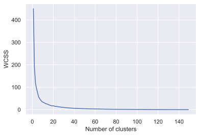
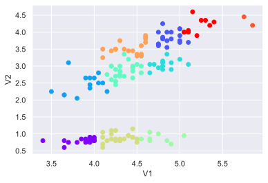

# ACM Research Coding Challenge (Fall 2020)

## No Collaboration Policy

**You may not collaborate with anyone on this challenge.** You _are_ allowed to use Internet documentation. If you _do_ use existing code (either from Github, Stack Overflow, or other sources), **please cite your sources in the README**.

## Submission Procedure

Please follow the below instructions on how to submit your answers.

1. Create a **public** fork of this repo and name it `ACM-Research-Coding-Challenge`. To fork this repo, click the button on the top right and click the "Fork" button.
2. Clone the fork of the repo to your computer using . `git clone [the URL of your clone]`. You may need to install Git for this (Google it).
3. Complete the Challenge based on the instructions below.
4. Email the link of your repo to research@acmutd.co with the same email you used to submit your application. Be sure to include your name in the email.

## Question One

 
Given the following dataset in `ClusterPlot.csv`, determine the number of clusters by using any clustering algorithm. **You're allowed to use any Python library you want to implement this**, just document which ones you used in this README file. Try to complete this as soon as possible.

Regardless if you can or cannot answer the question, provide a short explanation of how you got your solution or how you think it can be solved in your README.md file.

## Solution

The number of optimal clusters is 10. Let me explain how I came to the conclusion.

The dataset V1 and V2 can be seen as a bunch of x and y values, meaning we can plot them on a graph and using "Kmeans Clustering" the nearest mean can be calculated to create clusters from the given points.

**What is "Kmeans Clustering"?** "Kmeans clustering is a method of vector quantization, originally from signal processing, that aims to partition n observations into k clusters in which each observation belongs to the cluster with the nearest mean, serving as a prototype of the cluster." -Wikipedia

I learned more about K-means from the UTD Unsupervised Learning slide found [here](https://personal.utdallas.edu/~nrr150130/cs4375/2019fa/lects/Lecture_12_Clustering.pdf).

So the first step I approached to solve this issue is learn more about the ["Elbow Method"](https://en.wikipedia.org/wiki/Elbow_method_(clustering)). Using the Elbow method, we can produce a graph which looks like an elbow, and it comes handy when we are confused as to how many clusters do we need. What elbow method does is it starts off with making one cluster to the number of clusters in our sample and with the kmeans inertia value we determine what would be the appropriate number of clusters.

The Elbow Graph shows us how the elbow point comes at around **10** and this our optimal number of clusters for the above data which we should choose. If we look at the figure carefully after **10** when we go on increasing the number of cluster there is no big change in the wcss and it remains constant.

We will now quickly perform the kmeans clustering with the new number of clusters which is **10** and use different colors to separate the clusters.

 

**P.S.** I did not know how to perform clustering before so I had to teach myself. I have used various sources and guides to get an idea about what I am supposed to do, and what libraries might come in handy. I quickly discovered the kmeans clustering in Python which solved majority of the problem, and I used elbow method to find the optimal number of clusters.

## Work Cited

1. https://personal.utdallas.edu/~nrr150130/cs4375/2019fa/lects/Lecture_12_Clustering.pdf
2. https://en.wikipedia.org/wiki/Elbow_method_(clustering)
3. https://medium.com/code-to-express/k-means-clustering-for-beginners-using-python-from-scratch-f20e79c8ad00

